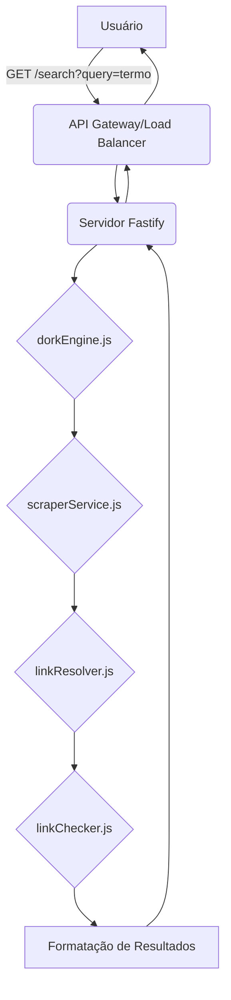

# Arquitetura e Estrutura de Pastas da API de Metabuscador de Lost Media

Este documento detalha a arquitetura proposta e a estrutura de pastas para a API RESTful em Node.js, focada na busca de Lost Media e arquivos raros em serviços de nuvem públicos.

## 1. Visão Geral da Arquitetura

A API será construída com base em um design modular, onde cada funcionalidade principal (geração de dorks, scraping, resolução de links e verificação de links) será encapsulada em seu próprio módulo. Isso garante **separação de preocupações**, **reusabilidade** e **facilidade de manutenção**. O framework Fastify será utilizado para o servidor web, devido à sua performance e baixo overhead.

### Fluxo de Dados

O fluxo de dados na API seguirá os seguintes passos:

1.  **Requisição do Usuário**: O usuário envia uma requisição `GET` para a rota `/search` com um termo de busca (`query`).
2.  **Geração de Dorks**: O `dorkEngine` recebe o termo de busca e gera uma lista de Google/DuckDuckGo Dorks otimizadas para encontrar arquivos em serviços de nuvem específicos.
3.  **Metabusca Assíncrona**: O `scraperService` recebe as dorks geradas e executa requisições assíncronas e paralelas para motores de busca (via SearxNG, DuckDuckGo HTML ou SerpAPI). Ele extrai URLs potenciais dos resultados.
4.  **Resolução de Links Diretos**: Para cada URL potencial, o `linkResolver` tenta converter a URL original em um link de download direto, utilizando lógicas específicas para cada plataforma (Google Drive, Mega.nz, etc.).
5.  **Verificação de Links**: O `linkChecker` recebe os links de download direto e realiza requisições `HEAD` para verificar a sua validade (status HTTP 200).
6.  **Formatação e Resposta**: Os links válidos são formatados em um objeto JSON padronizado e retornados ao usuário como resposta da API.



## 2. Estrutura de Pastas

A estrutura de pastas será organizada para refletir a modularidade e facilitar a navegação e o desenvolvimento. A pasta `src` conterá todo o código-fonte da aplicação.

```
.editorconfig
.env.example
.gitignore
package.json
package-lock.json
README.md
src/
├── config/
│   └── index.js         # Configurações globais, chaves de API, etc.
├── controllers/
│   └── searchController.js # Lógica de controle para a rota de busca
├── services/
│   ├── dorkEngine.js     # Geração de dorks
│   ├── scraperService.js # Metabusca e extração de links
│   ├── linkResolver.js   # Resolução de links diretos
│   └── linkChecker.js    # Verificação de links
├── utils/
│   └── errorHandler.js   # Utilitários para tratamento de erros
└── app.js                # Arquivo principal da aplicação Fastify
```

### Descrição das Pastas:

*   **`config/`**: Contém arquivos de configuração para a aplicação, como chaves de API para SerpAPI, URLs de instâncias SearxNG, etc.
*   **`controllers/`**: Responsável por lidar com a lógica de requisição e resposta das rotas da API. O `searchController.js` orquestrará as chamadas aos serviços.
*   **`services/`**: Contém a lógica de negócios principal da aplicação, dividida em módulos especializados, conforme descrito na visão geral da arquitetura.
*   **`utils/`**: Módulos com funções utilitárias que podem ser usadas em várias partes da aplicação, como tratamento de erros, formatação de dados, etc.
*   **`app.js`**: O ponto de entrada da aplicação, onde o servidor Fastify é inicializado, as rotas são definidas e os módulos são importados.

Esta estrutura visa promover um código limpo, organizado e escalável, facilitando a adição de novas funcionalidades e a manutenção do sistema. 
sistema.
